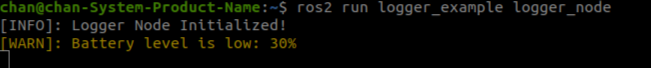

# 📚 ROS 2 : Logger 실습 

---

## 🧨  패키지 생성

```bash
cd ~/ros2_ws/src
ros2 pkg create --build-type ament_cmake logger_example --dependencies rclcpp
```

---

## 📄 예제 코드

```cpp
#include "rclcpp/rclcpp.hpp"

class LoggerNode : public rclcpp::Node {
public:
    LoggerNode() : Node("logger_node") {
        RCLCPP_INFO(this->get_logger(), "Logger Node Initialized!");

        int battery_level = 30;

        if (battery_level > 50) {
            RCLCPP_INFO(this->get_logger(), "Battery level is good: %d%%", battery_level);
        } else if (battery_level > 20) {
            RCLCPP_WARN(this->get_logger(), "Battery level is low: %d%%", battery_level);
        } else {
            RCLCPP_ERROR(this->get_logger(), "Battery critically low: %d%%", battery_level);
        }
    }
};

int main(int argc, char *argv[]) {
    rclcpp::init(argc, argv);
    rclcpp::spin(std::make_shared<LoggerNode>());
    rclcpp::shutdown();
    return 0;
}
```

---

## 📄 CMakeLists.txt 수정

```cmake
add_executable(logger_node src/logger_node.cpp)
ament_target_dependencies(logger_node rclcpp)
install(TARGETS
  logger_node
  DESTINATION lib/${PROJECT_NAME}
)
```

---

## 🚀  빌드 및 실행

```bash
cd ~/ros2_ws
colcon build -packages-select logger_example
source install/setup.bash

ros2 run logger_example logger_node
```

---

## ✅  출력 결과 





