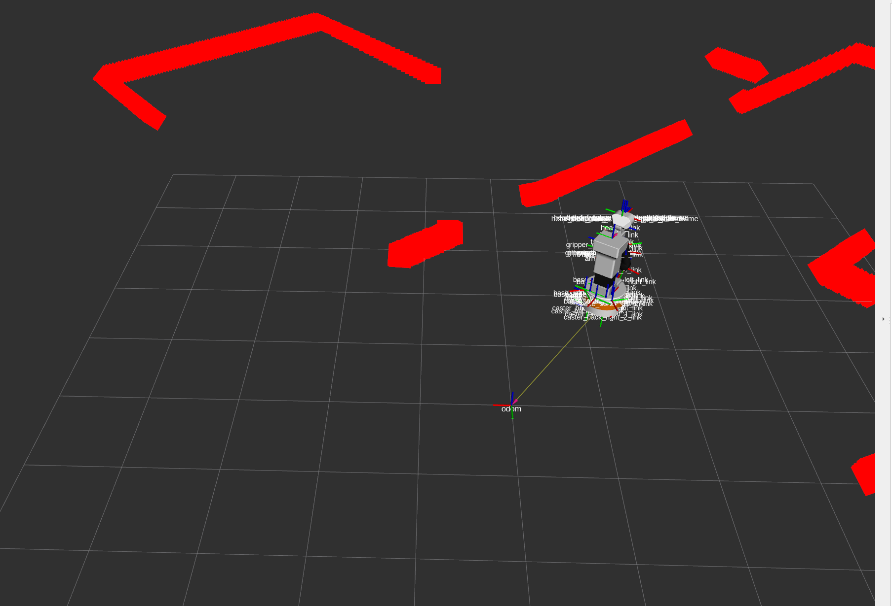

# 📚 ROS 2 : Rviz2 실습 

---

## 🧨 Tiago 시뮬레이션 환경 실행

```bash
source ~/tiago_public_ws/install/setup.bash  
ros2 launch pal_gazebo tiago_gazebo.launch.py
```
---

## 🎍 RViz2 실행

```bash
rviz2
```

---

## 🎉 RViz2 설정

1. Fixed Frame 설정 
   - 좌측 상단 `Global Options` → `Fixed Frame`을 `odom` 또는 `map`으로 설정  

2. Display 추가 (Add 버튼 클릭)
   - `TF`: 로봇 좌표 프레임 트리 시각화  
   - `RobotModel`: Tiago 로봇 모델 표시 (자동 인식)  
   - `LaserScan`: LIDAR 데이터 (예: `/scan` 토픽)  
   - `Path`: 로봇 주행 경로 (`/plan` 또는 `/nav_path` 등)  
   - `Map`: 맵 데이터 (`/map` 토픽, SLAM이나 Navigation 활성화 시 사용)  

---

## 🎮 로봇 주행 명령 실행

```bash
ros2 topic pub /goal_pose geometry_msgs/PoseStamped "header:
  frame_id: 'map'
pose:
  position:
    x: 2.0
    y: 1.0
    z: 0.0
  orientation:
    w: 1.0"
```

- 또는 RViz2 상단 메뉴에서 2D Nav Goal 버튼 클릭 → 지도에서 목표 지점 지정  

---

## 🎈 RViz2에서 주행 결과 확인

- 로봇 모델이 이동하는 모습 확인   
- `TF`로 로봇 위치 및 프레임 정보 시각화  
- `LaserScan`으로 라이다 센서 데이터 표시  

---

