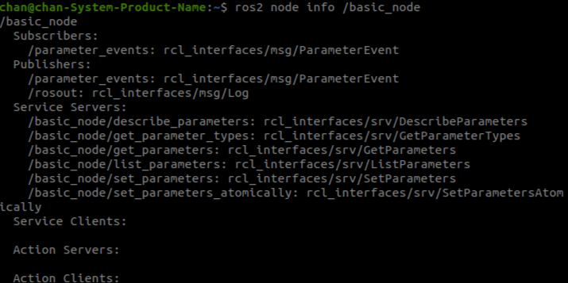
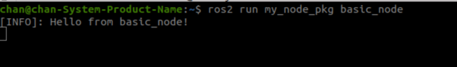
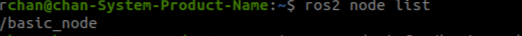

# 🧮 ROS 2 : Node(C++)


---

## 1️⃣ 실행 중인 노드 확인하기

### 🔍 현재 실행 중인 노드 리스트

```bash
ros2 node list
```

출력 결과 :

- 실행된 노드가 없다면 빈 결과가 나옴

---

### 🔍 특정 노드의 상세 정보 확인

```bash
ros2 node info /talker
```

출력 결과 :



---

## 2️⃣ C++ 노드 직접 만들기 

### 📦 패키지 생성

```bash
cd ~/ros2_ws/src
ros2 pkg create --build-type ament_cmake my_node_pkg
```

---

### ✍️ 노드 작성: `src/basic_node.cpp`

```cpp
#include "rclcpp/rclcpp.hpp"

class BasicNode : public rclcpp::Node {
public:
  BasicNode() : Node("basic_node") {
    RCLCPP_INFO(this->get_logger(), "Hello from basic_node!");
  }
};

int main(int argc, char **argv) {
  rclcpp::init(argc, argv);
  rclcpp::spin(std::make_shared<BasicNode>());
  rclcpp::shutdown();
  return 0;
}
```

---

### ⚙️ `CMakeLists.txt` 수정

```cmake
find_package(rclcpp REQUIRED)

add_executable(basic_node src/basic_node.cpp)
ament_target_dependencies(basic_node rclcpp)

install(TARGETS
  basic_node
  DESTINATION lib/${PROJECT_NAME}
)
```

---

### 🏗️ 패키지 빌드 및 환경 설정

```bash
cd ~/ros2_ws
colcon build --packages-select my_node_pkg --symlink-install
source install/setup.bash
```

---

### 🚀 노드 실행

```bash
ros2 run my_node_pkg basic_node
```

출력 결과:



### ✅ 실행 중 노드 다시 확인

```bash
ros2 node list
```

출력 결과:

