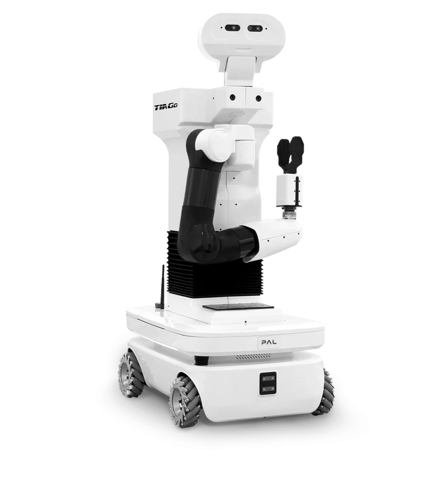

# 🧮 ROS 2 (Robot Operating System 2)


---

## ✅ ROS 2란?

- ROS 2는 로봇 소프트웨어 개발을 위한 오픈소스 프레임워크로, 센서, 액추에이터, 알고리즘 등을 모듈화하여 쉽게 통신하고 제어할 수 있게 함
- 기존 ROS 1의 한계를 보완하여 실시간성, 보안성, 분산처리를 강화하고 DDS(Data Distribution Service) 기반 통신을 사용
- 자율주행, 드론, 서비스 로봇 등 다양한 로봇 시스템 개발에 폭넓게 활용

---

## ✅ ROS의 장점/단점

- 장점
  - 무료, 사용자가 가장 많음
  - 활성화된 커뮤니티, 오픈소스
  - 기존 프로그램을 ROS에 이식하기 쉬움
  - 센서 드라이버, SLAM, Navigation, 매니퓰레이팅 모두 해결

- 단점
  - 단일 로봇을 위한 솔루션이고, 높은 PC의 연산 능력을 요구함
  - 네트워크에 의존성이 높음
  - 보장되지 않는 실시간성
  - 임베디드 시스템에서 사용하기 어려움

---

## ✅ ROS 1 vs ROS 2 비교

|항목	|ROS 1|	ROS 2|
|----|----|----|
|통신 방식|Custom TCP/UDP 기반 (ROS Master 의존)|	DDS (Data Distribution Service) 기반|
| 실시간 처리|	실시간성 지원 부족|	실시간성 지원 강화 (RTOS 호환)|
| 보안 기능|	기본적으로 없음|	DDS 보안 프로토콜 내장 (암호화 등)|
| 분산 시스템 지원|	마스터 노드 필요 (중앙 집중형)|	분산 구조 가능 (Masterless Architecture)|
| 멀티 플랫폼 지원|	주로 Linux, 제한적인 Windows 지원|	Linux, Windows, macOS 등 크로스 플랫폼|
| 테스트 도구|	기본적 기능 제공|	ROS 2는 통합 테스트 프레임워크 강화|
| 개발 언어|	C++, Python|	C++, Python (Rust, Java 등도 점차 확대)|
| 사용 목적|	연구/교육 중심|	상용 로봇 제품에 적합한 구조|
| 패키지 관리 도구|	rosbuild, catkin|	ament, colcon (더 강력하고 유연함)|

---

## 📦 ROS2 주요 특징

| 항목 | 설명 |
|------|------|
| 실시간성 (Real-time) | DDS 기반의 미들웨어를 사용하여 실시간 시스템 지원 |
| 분산 시스템 지원 | 여러 노드가 분산 환경에서도 안정적으로 통신 가능 |
| QoS 정책 | 네트워크 품질 제어 (지연, 손실 허용 등 조정 가능) |
| 멀티 플랫폼 | Linux, Windows, macOS, 그리고 일부 RTOS까지 지원 |
| 보안 | DDS-Security 기반의 인증 및 암호화 기능 |
| 모듈화 | 기능 단위로 구성되어 유지 보수가 용이 |

---

## 🧱 구조 개요

```
+-----------------------------+
|         Application         |
+-----------------------------+
|        rclcpp / rclpy       | ← C++ / Python 클라이언트 라이브러리
+-----------------------------+
|             RCL             | ← 공통 인터페이스 계층
+-----------------------------+
|            RMW              | ← DDS와 ROS 2 간의 인터페이스
+-----------------------------+
|             DDS             | ← 미들웨어 (Fast DDS, Cyclone DDS 등)
+-----------------------------+
```

---

## 🔗 핵심 개념

### 1. Node
- 하나의 기능 단위를 의미 (예: 센서 읽기, 모터 제어 등)

### 2. Topic
- Publish/Subscribe 모델을 통한 메시지 통신

### 3. Service
- 요청/응답 통신 구조

### 4. Action
- 진행 중 상태 피드백이 가능한 작업 구조

### 5. Parameter
- 노드의 런타임 설정값 제어

---

## 📁 주요 명령어

```bash
ros2 pkg create --build-type ament_cmake my_package
ros2 run [패키지명] [노드명]
ros2 topic list
ros2 topic echo /topic_name
ros2 service list
ros2 service call /service_name
ros2 param list
ros2 param set /node_name parameter_name value
```

---

## 🧪 예제

```python
import rclpy
from rclpy.node import Node
from std_msgs.msg import String

class MinimalPublisher(Node):
    def __init__(self):
        super().__init__('talker')
        self.publisher_ = self.create_publisher(String, 'chatter', 10)
        timer_period = 0.5
        self.timer = self.create_timer(timer_period, self.timer_callback)

    def timer_callback(self):
        msg = String()
        msg.data = 'Hello, ROS 2!'
        self.publisher_.publish(msg)
        self.get_logger().info(f'Publishing: "{msg.data}"')

def main(args=None):
    rclpy.init(args=args)
    node = MinimalPublisher()
    rclpy.spin(node)
    node.destroy_node()
    rclpy.shutdown()
```


## 🧩 활용 분야

- 자율주행 로봇
- 산업용 로봇
- 의료 로봇
- 드론
- IoT 연동 로봇

---

## 🎈 실습환경 구성하기(TIAGO)



- TIAGo는 PAL Robotics에서 개발한 인간-로봇 상호작용 및 서비스 로봇 연구용 모바일 매니퓰레이터
- 팔, 손, 리프트, 베이스가 결합되어 있어 물체 조작, 내비게이션, 음성 상호작용 등 다양한 작업을 수행할 수 있음
- ROS/ROS 2 기반으로 작동하며, 시뮬레이션 및 실제 로봇에서 모두 사용 가능
---

## 🧨 로봇 시뮬레이션 환경 구성하기(ROS2 humble 설치후)

```bash
sudo apt install ros-humble-tiago-gazebo
```
---
## ✨로봇 시뮬레이션 실행

```bash 
ros2 launch tiago_gazebo tiago_gazebo.launch.py is_public_sim:=True
```