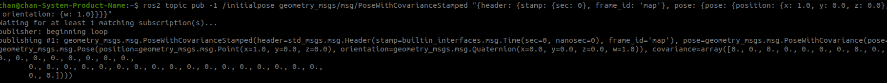

# 📚 ros2 : AMCL 기반 초기 위치 설정 방법 

---

## 📡 RViz2에서 2D Pose Estimate 사용


- Rviz2 상단 툴바에서 `2D Pose Estimate` 클릭  
- 지도 상에서 클릭 & 드래그로 로봇의 초기 위치와 방향 설정  


---

## ➿ 터미널에서 initialpose 토픽 이용

```bash
ros2 topic pub /initialpose geometry_msgs/PoseWithCovarianceStamped "
header:
  frame_id: 'map'
pose:
  pose:
    position: {x: 1.0, y: 2.0, z: 0.0}
    orientation: {x: 0.0, y: 0.0, z: 0.0, w: 1.0}
  covariance: [0.25, 0, 0, 0, 0, 0,
                0, 0.25, 0, 0, 0, 0,
                0, 0, 0, 0, 0, 0,
                0, 0, 0, 0, 0, 0,
                0, 0, 0, 0, 0, 0,
                0, 0, 0, 0, 0, 0.068]"
```
- 현재 위치 정보 확인


- ros2 topic echo /clicked_point를 사용해 토픽을 구독
- rviz2 상단 툴바에서 'Publish Point' 클릭 후 원하는 위치에 마우스 클릭
- 출력 결과 :

 


- 원하는 위치 값 명령어로 입력
- 예시 : 

```bash
ros2 topic pub -1 /initialpose geometry_msgs/msg/PoseWithCovarianceStamped 
"{header: {stamp: {sec: 0}, frame_id: 'map'}, pose: {pose: {position: {x: 1.0, y: 0.0, z: 0.0}, orientation: {w: 1.0}}}}"
```

- 출력 결과 :

 

 


---

## 🔍 저장한 지도 YAML 파일에서 직접 수정 (자동 초기 위치 설정)

```yaml
image: my_map.pgm
resolution: 0.05
origin: [1.0, 0.0, 0.0]  
negate: 0
occupied_thresh: 0.65
free_thresh: 0.196
```


- `origin` 값 수정 시 초기 위치가 자동으로 반영
 
---


