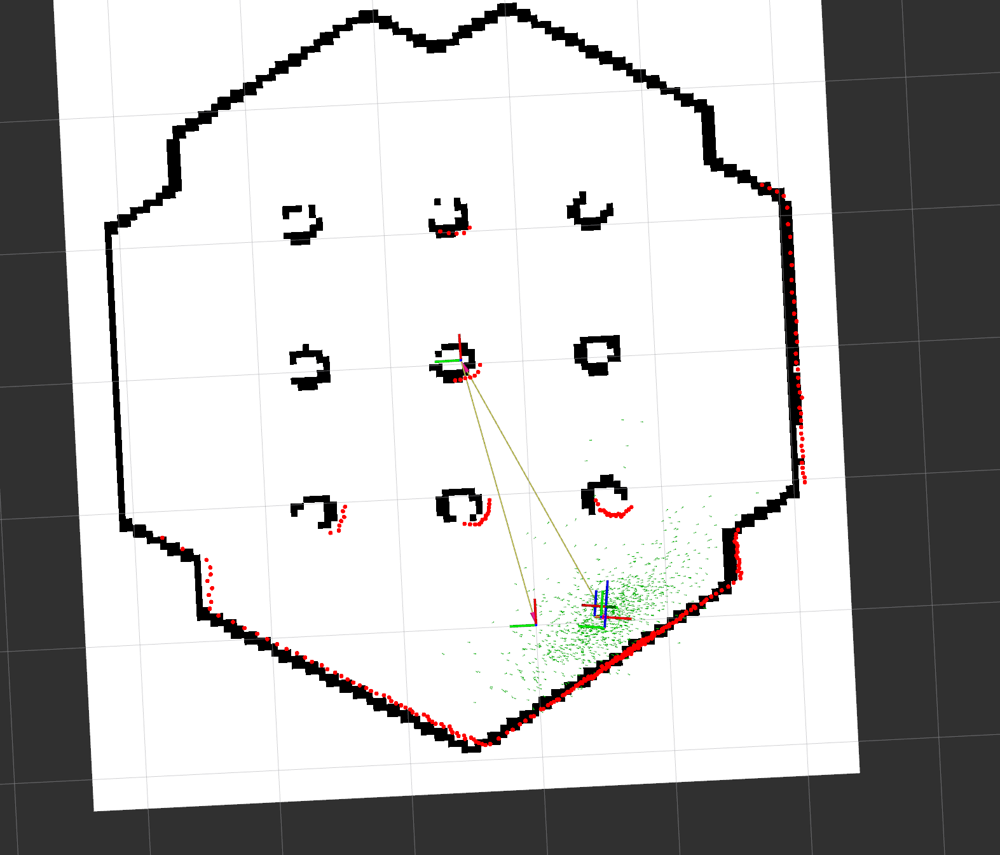

# 🚀 ROS 2 : AMCL 실습

---

## 🎒 환경 준비

### 🎓 필요한 패키지 설치
```bash
sudo apt update
sudo apt install -y ros-humble-navigation2 ros-humble-nav2-bringup \
ros-humble-turtlebot3-navigation2 ros-humble-turtlebot3-gazebo
```
---
### 🎏  환경 변수 설정 

```bash
echo 'export TURTLEBOT3_MODEL=burger' >> ~/.bashrc
source ~/.bashrc
```

---

## 💻 Gazebo 시뮬레이션 실행

```bash
ros2 launch turtlebot3_gazebo turtlebot3_world.launch.py
```

---

## 📺 AMCL 기반  Localization 실행 (저장한 지도 사용)

```bash
ros2 launch turtlebot3_navigation2 navigation2.launch.py \
    use_sim_time:=true map:=/home/chan/map/my_map.yaml
```

---

### 📌 RViz2 설정
- ADD -> Particlecloud 추가 및 topic 변경
- Laserscan -> Size(Pixels) 수정 (선명하게 확인하기 위해 선 굵기 수정)

---

### 📌 로봇 초기 위치 설정 (2D Pose Estimate)
- RViz2 상단 툴바에서 `2D Pose Estimate` 클릭  
- 로봇의 예상 위치와 방향을 지도 상에 클릭 & 드래그로 설정  

---

## 🎄 로봇 수동 주행 및 Localization 확인

### 📱 수동 주행 (Teleop Keyboard)
```bash
ros2 run teleop_twist_keyboard teleop_twist_keyboard 
```
- 키보드로 로봇을 직접 움직이며 Particle Cloud가 로봇 움직임에 맞춰 추적하는지 확인  

### 🎥 Localization 성공 확인
- Particle Cloud가 로봇 주변에 잘 모여 있고, RViz2 상에서 로봇 위치가 정확할 때 Localization 성공  
 
 

---

