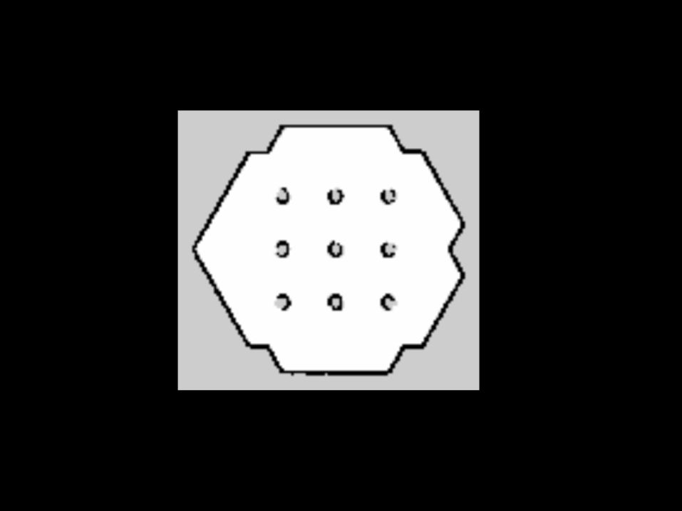

# 📚 ROS 2 : Cartographer Mapping 실습

---

## 🎒  환경 준비

### 🎓 필요한 패키지 설치
```bash
sudo apt update
sudo apt install -y ros-humble-cartographer ros-humble-cartographer-ros \
ros-humble-gazebo-ros-pkgs ros-humble-turtlebot3-gazebo \
ros-humble-turtlebot3-cartographer
```

### 🎏  환경 변수 설정 
```bash
echo 'export TURTLEBOT3_MODEL=burger' >> ~/.bashrc
source ~/.bashrc
```

---

## 💻 Gazebo 시뮬레이션 실행
```bash
ros2 launch turtlebot3_gazebo turtlebot3_world.launch.py
```

---

## 📺 Cartographer 매핑 실행
```bash
ros2 launch turtlebot3_cartographer cartographer.launch.py use_sim_time:=true
```
- teleop_twist_keyboard 를 이용하여 로봇을 주행하며 지도 작성

- 출력 결과 :


---

## 🎄 지도 저장

### 📱 저장할 디렉토리 생성

```bash
mkdir -p /home/chan/map
```
---

### 🎥 지도 저장
```bash
ros2 run nav2_map_server map_saver_cli -f /home/chan/map/my_map
```




---


